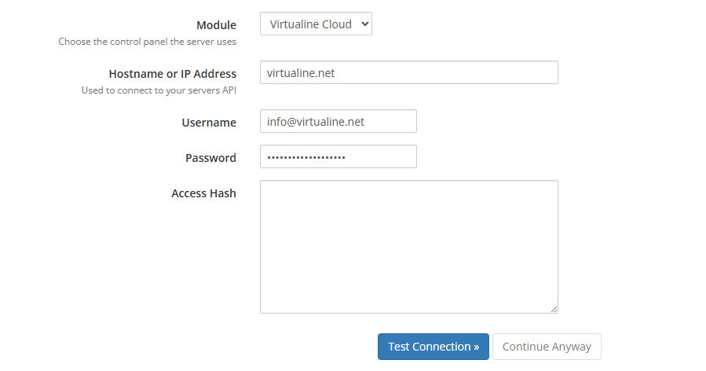
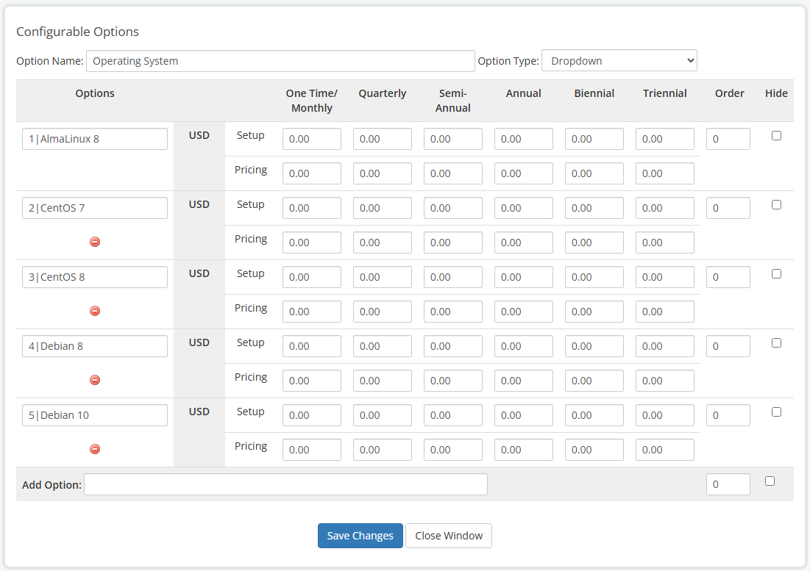
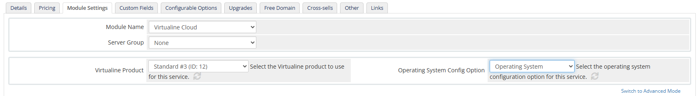

# Virtualine Cloud WHMCS Module

  

A powerful WHMCS module for seamless integration with Virtualine Cloud services, enabling automated provisioning and management of virtual servers.

## Features

- 🚀 Automated server provisioning
- 🔄 Real-time server status monitoring
- 💾 Multiple operating system support
- 🔒 Secure API integration
- ⚡ Instant server deployment
- 📊 Resource usage monitoring

## Installation

1. Download the latest release from the releases page
2. Extract the ZIP file directly into your WHMCS root directory
3. The module will be automatically installed and ready for configuration

## Configuration

### 1. Server Setup

1. Navigate to WHMCS Admin Panel > Settings > Servers > Add New Server
2. Select "Virtualine Cloud" as the Module
3. Configure the following settings:
   - Hostname/IP Address: `virtualine.net`
   - Username: Your email address
   - Password: Your API key
4. Click "Test Connection" to verify your credentials
5. Enter a name for your server and save the configuration

### 2. Configurable Options Setup

1. Go to Settings > Configurable Options > Create a New Group
2. Set "Group Name" to "Virtualine"
3. Click "Save Changes"
4. In the Configurable Options section, click "Add New Configurable Option"
5. Configure the following:
   - Option Name: "Operating System"
   - Option Type: "Dropdown"
6. Add operating systems using the format: `ID|Operating System Name`
   - Example: `1|AlmaLinux 8`

#### Supported Operating Systems

| ID | Operating System |
|----|-----------------|
| 1 | AlmaLinux 8 |
| 2 | CentOS 7 |
| 3 | CentOS 8 |
| 4 | Debian 8 |
| 5 | Debian 10 |
| 6 | Debian 11 |
| 7 | Rocky 8 |
| 8 | Ubuntu 18.04 |
| 9 | Ubuntu 20.04 |
| 10 | Ubuntu 22.04 |
| 11 | Windows Server 2012 R2 |
| 12 | Windows Server 2019 |
| 13 | Windows Server 2022 |
| 14 | Windows 10 |
| 15 | FreeBSD 13 |
| 16 | Windows 11 |
| 17 | Windows 7 |
| 18 | Windows 8 |
| 19 | Windows 8.1 |
| 20 | Windows Server 2025 |
| 21 | Windows Server 2016 |
| 22 | AlmaLinux 9 |
| 23 | CentOS 9 Stream |
| 24 | Debian 12 |
| 25 | Ubuntu 24.04 |

> **Note:** You can create multiple groups for different operating system categories (e.g., Linux-only, Windows-only) by repeating the configuration process with different group names.

### 3. Product Configuration

1. Navigate to Settings > Products/Services
2. Create a new product group if needed
3. Click "Create a New Product" and configure:
   - Product Type: "Server/VPS"
   - Select your desired Product Group
   - Enter Product Name
   - Module: "Virtualine Cloud"
   - Toggle "Create as Hidden" based on your requirements
4. In the Details section:
   - Disable "Require Domain"
5. In the Configurable Options section:
   - Select your previously created Virtualine configurable options
6. In Module Settings:
   - Select your Virtualine Product
   - Choose "Operating System" from the Operating System Config Option dropdown

## Frequently Asked Questions (FAQ)

### General Questions

**Q: How do I get my API key?**  
A: You can obtain your API key from the [Virtualine Reseller Panel](https://client.virtualine.net/index.php?m=ProductsReseller). To access your API credentials:
1. Log in to your Virtualine Customer Panel
2. Navigate to Services > Reseller Area
3. Go to the Settings tab
4. Find your API credentials in this section

**Q: How can I become a Reseller?**  
A: To become a Virtualine Reseller and get access to the Reseller Panel, please contact our sales team through the Virtualine website.

**Q: What are the minimum system requirements?**  
A: The module requires WHMCS 8.0 or higher and PHP 7.4 or higher.

**Q: Can I use multiple server configurations?**  
A: Yes, you can create multiple server configurations for different purposes or regions.

### Troubleshooting

**Q: The module shows "Connection Failed" error**  
A: Please verify:
- Your API key is correct
- Your email address is properly entered
- Your server has internet connectivity
- The Virtualine Cloud API is accessible

**Q: Operating systems are not showing in the dropdown**  
A: Ensure that:
- The configurable options are properly set up
- The format for adding operating systems is correct (ID|Name)
- The product is properly linked to the configurable options

**Q: Server provisioning fails**  
A: Check:
- Your API key has sufficient permissions
- The selected operating system is available
- Your account has sufficient resources

## Support

For support and assistance, please contact our support team or visit our documentation.

## License

This project is licensed under the MIT License - see the [LICENSE](LICENSE) file for details.
